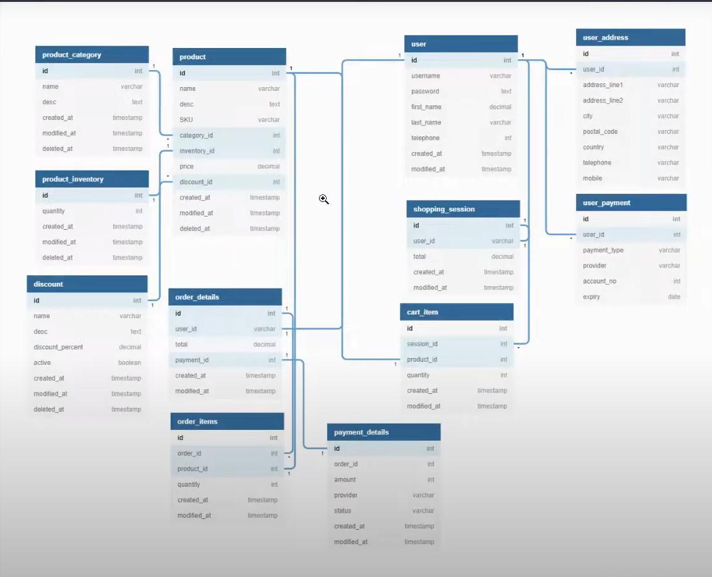

# Ecommerce Backend API


Welcome to the **Ecommerce Backend API** repository for mid-level PHP


---

## Table of Contents
- [Setup Project](#setup-project)
- [Making models](#making-models)
- [Add data columns](#add-data-columns)
- [Install lang translation](#install-lang-translation)
- [Migration Seeder](#migration-seeder)


---


## Setup Project
There introduction of creating project:
- **Installing:** 
 ```bash
 laravel new <project-name>
 ```
- **For API**
   ```bash
   > breeze

   Which Breeze stack would you like to install?
   [blade]  Blade with Alpine
   [Livewire] (Volt Class API) with Alpine
   [Livewire] (Volt Functional API) with Alpine
   [React] with Inertia
   [Vue] with Inertia
   [api] API only
   
   > api
   ```
Installing sanctum ( Sanctum helps secure the API by providing token-based authentication )
- **Sanctum:** (```composer require laravel/sanctum```)

Key Generation
- **Command:** 
   ```bash
   php artisan key:generate
   ```


## Making models
There introduction of creating models:
 ```bash
 php artisan make:model <model-name> -a
 ```


## Add data columns
Add necessary colums to migrated files (database/migrations/your-migration-file.php):
 - Example:
 ```
  public function up(): void
    {
        Schema::create('categories', function (Blueprint $table) {
            $table->id();
            $table->string('name');
            $table->text('icon')->nullable();
            $table->timestamps();
        });
    }
 ```


## Install lang translation
Use any component that you prefer (Example: Spatie -> https://spatie.be/docs/laravel-translatable/v6/introduction)
 - Install:
 ```bash
 composer require spatie/laravel-translatable
 ```


## Migration Seeder
- First time use:
 ```bash
 php artisan migrate --seed
 ```
- Then to update:
 ```bash
 php artisan migrate:fresh --seed
 ```
